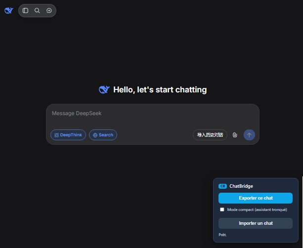
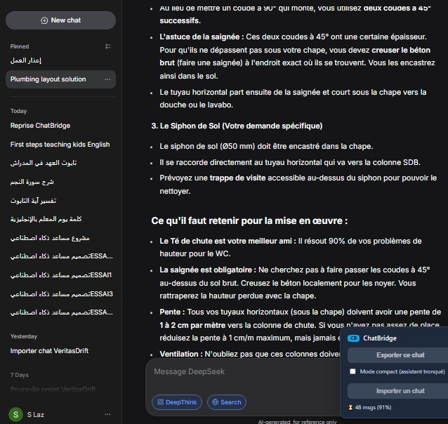
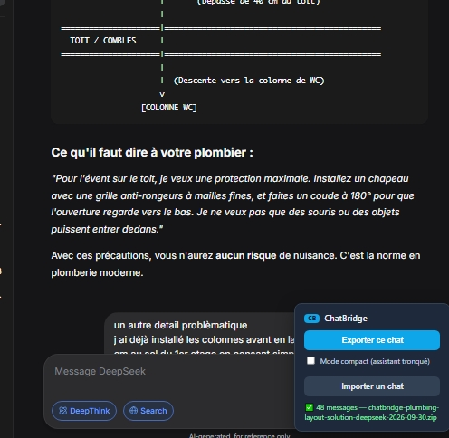
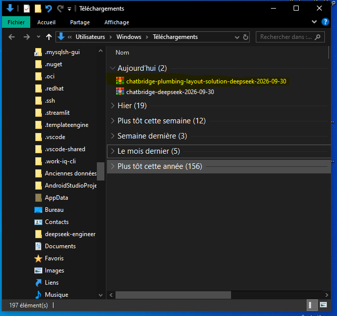
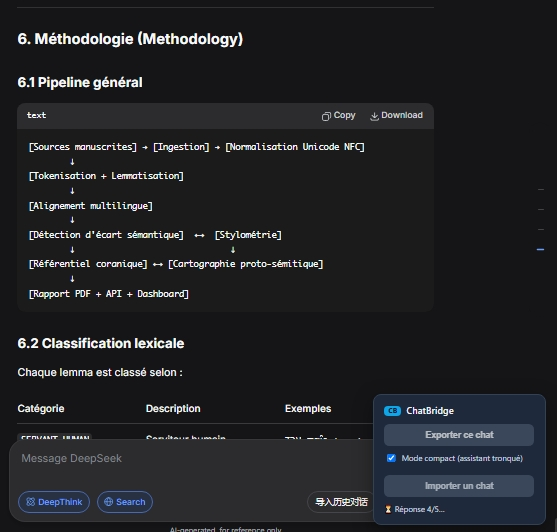
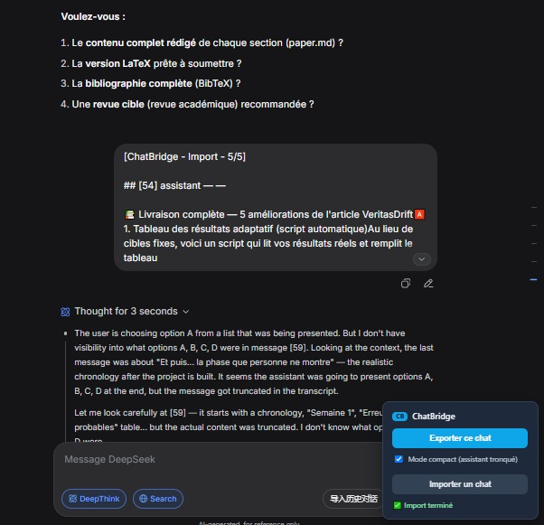

# ChatBridge

[](https://doi.org/10.5281/zenodo.23067074)
[](https://github.com/slaz851945/chatbridge/actions/workflows/ci.yml)
[](https://www.gnu.org/licenses/agpl-3.0)

> Pont portable entre sessions LLM. Export/import intégral de longs chats (DeepSeek, ChatGPT), **100 % local**.

## Statut

**v0.1.0** — premier release fonctionnel. Export et import opérationnels sur DeepSeek.

## Fonctionnalités

### Export
- Extraction intégrale d'un chat DeepSeek (scroll virtualisé, thinking inclus).
- Format canonique : `chat.json` (source de vérité) + `chat.md` (lisible) + `manifest.json`.
- Archive `.zip` téléchargeable en un clic.
- Hash SHA-256 pour vérification d'intégrité.
- Traitement 100 % local, fonctionne hors ligne une fois exporté.

### Import
- Lecture d'un `.zip` ou `.json` ChatBridge.
- Segmentation automatique en chunks (~12 000 chars, ou mode compact à 800 chars pour les longs chats).
- Envoi séquentiel avec attente de la réponse de l'assistant entre chaque chunk.
- Pacing anti rate-limit (pauses progressives).
- Détection de fin robuste (indépendante du DOM virtualisé).

## Installation


### Développeur

```bash
nvm use
npm install
npm run quality
npm run dev     #  g userscript en watch mode

```
---

# Utilisateur
Installer Tampermonkey.

Builder le userscript : npm run build.

Ouvrir dist/chatbridge.user.js dans Tampermonkey (Dashboard → + → coller → Ctrl+S).

Ouvrir chat.deepseek.com — le panneau ChatBridge apparaît en bas à droite.

# Utilisation

## Export
Ouvre le chat à exporter.

Clique « Exporter ce chat ».

Le .zip se télécharge automatiquement.

## Import
Ouvre un chat vide dans DeepSeek.

Coche « Mode compact » si le chat dépasse ~120 chunks.

Clique « Importer un chat » → sélectionne le .zip ChatBridge.

Laisse tourner (5-15 min selon la taille).

# Architecture
Clean Architecture à 4 couches :

- domain/ — modèles purs, hashing, formats (aucune dépendance).

- application/ — cas d'usage, ports, chunking, orchestrateurs.

- infrastructure/ — adaptateurs DeepSeek, sérialiseurs, intercepteur API.

- interface/ — userscript (Panel Shadow DOM, download, bootstrap).

- Cadre de travail
Voir docs/00_WORKING_AGREEMENT.md. Cycle en 7 phases, DoR/DoD stricts, 0 mypy/ruff, coverage ≥ 82 %.

## Captures d'écran

### Panneau ChatBridge

Ouvre n'importe quel chat DeepSeek.



### Export en cours

Clique « Exporter ce chat ».

Attends 5-10 secondes que la progression démarre.



### Export terminé

Attends la fin de l'export.

Le panneau affiche ✅ N messages — chatbridge-xxx.zip.




### Contenu du ZIP

Ouvre le fichier .zip téléchargé (double-clic).

Tu vois les 3 fichiers : chat.json, chat.md, manifest.json.




### Import en cours

Ouvre un nouveau chat DeepSeek vide.

Coche Mode compact.

Clique « Importer un chat » → sélectionne le ZIP.

Attends que le statut affiche 📤 Envoi X/Y… ou ⏳ Réponse X/Y….


### Import terminé


Attends la fin de l'import.

Le panneau affiche ✅ Import terminé.

Scrolle un peu pour montrer que les messages ont bien été réinjectés.


- Licence
AGPL-3.0-or-later.
